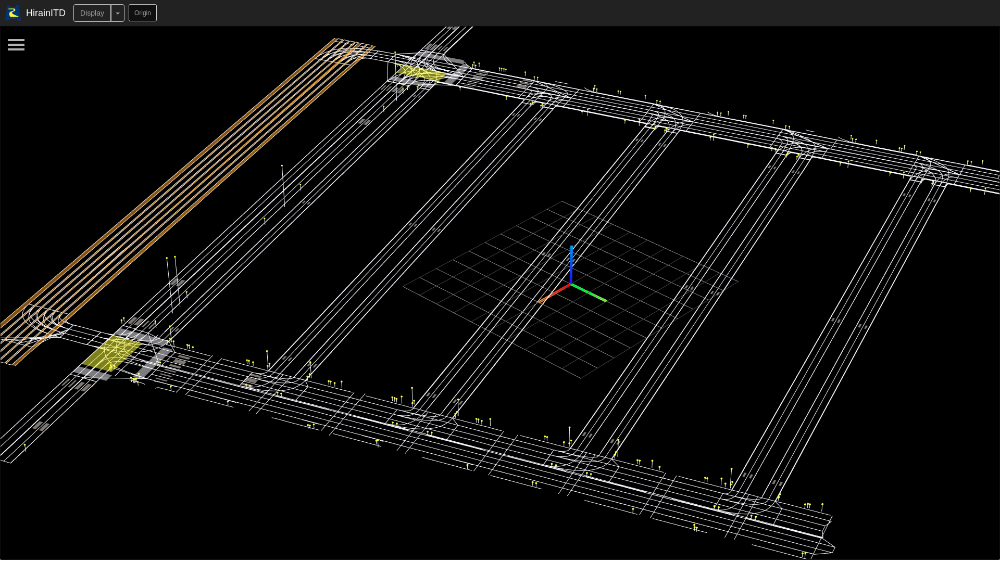
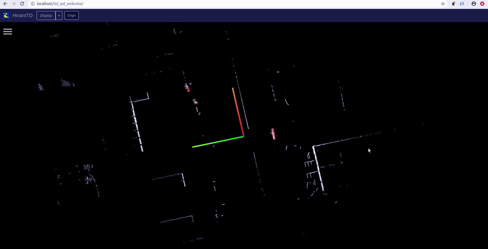
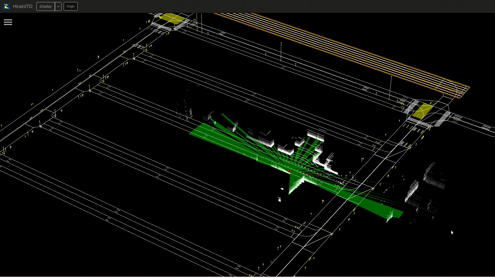

# ITD IPD WEBVIEW

## Author
| Name | Github | Email Address |
| ------- | ------ |   ----   |
| Feng DING  | [FengD](https://github.com/FengD) | dingbobby@hotmail.com|
| Bo WANG  |  | |
| Jiafeng XU  |  | |

## Description
- This tool is used to display the status of an autonomous driving car, including its position, sensor output, hdmap, can signal, etc.
- It is an webviewer which could be used for all platform
- Using the responsive design so it could adjust any screen size

## Dependency
- `mqtt broker` ([mosquitto](https://github.com/eclipse/mosquitto) [emqx](https://github.com/emqx/emqx)) used for communication
- `protobuf` ([protobuf](https://github.com/protocolbuffers/protobuf) [protobufjs](https://github.com/protobufjs/protobuf.js)) used for message serialization and deserialization
- `web server` ([nginx](http://nginx.org/) apache, etc.)
- `Threejs` ([Threejs](https://threejs.org/))
- `mqttws31.js`

## ChangeLog

| Version | Update | Contractor | Description |
| ------- | ------ |   ----   |   --------  |
| V1.0.0  | 2020/1/29   |  Feng DING| Created the project, defined the structure  |
| V1.0.1  | 2020/2/10   |  Feng DING| Finish the demo of point cloud display  |
| V1.0.2  | 2020/2/15   |  Feng DING| Define the other geometry |
| V1.0.3  | 2020/4/23   |  Bo WANG, Jiafeng XU| Create checklist and input sidebar |
| V1.0.4  | 2020/5/29   |  Feng DING, Jiafeng XU, Bo WANG| add can signal display by using chart |
| V1.0.5  | 2020/6/10   |  Feng DING, Jiafeng XU| Add Hdmap display by using .shp files |
| V1.0.6  | 2020/6/11   |  Feng DING, Jiafeng XU| Position display, including wgs84 by using Mercator Projection and the Cartesian coordinates |
| V1.0.7  | 2020/6/30   |  Feng DING, Jiafeng XU| Add display element grouping which could group all the sersor result to car position |

## How to deployee the project
1. git clone https://github.com/FengD/autonomous_driving_webviewer.git
2. put the project in the folder of your web server folder path

## Demo
- HDmap display

- PointCloud

- Polygone

- Boundingbox

- Element grouping

